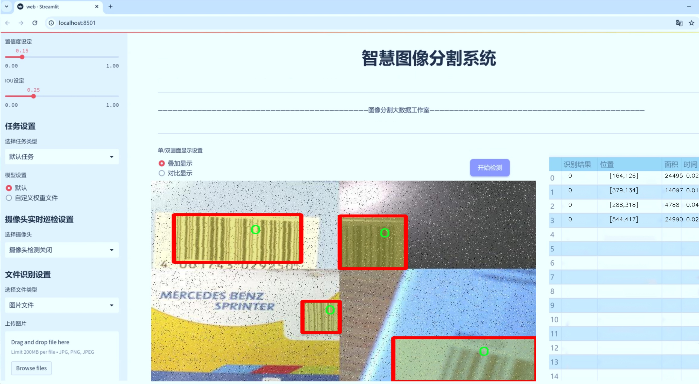

# 市场商品条形码分割系统源码＆数据集分享
 [yolov8-seg-slimneck＆yolov8-seg-FocalModulation等50+全套改进创新点发刊_一键训练教程_Web前端展示]

### 1.研究背景与意义

项目参考[ILSVRC ImageNet Large Scale Visual Recognition Challenge](https://gitee.com/YOLOv8_YOLOv11_Segmentation_Studio/projects)

项目来源[AAAI Global Al lnnovation Contest](https://kdocs.cn/l/cszuIiCKVNis)

研究背景与意义

随着电子商务的迅猛发展，市场商品的管理与识别变得愈发重要。在众多商品中，条形码作为一种广泛应用的自动识别技术，承载着商品的基本信息，如价格、生产日期、生产厂家等。条形码的快速、准确识别不仅提高了商品管理的效率，也为消费者提供了便捷的购物体验。然而，传统的条形码识别方法往往依赖于图像处理技术，受限于环境光照、商品摆放角度及条形码损坏等因素，导致识别率不高。因此，开发一种高效、准确的条形码分割系统显得尤为重要。

在这一背景下，YOLO（You Only Look Once）系列目标检测算法因其高效性和实时性，逐渐成为计算机视觉领域的研究热点。YOLOv8作为该系列的最新版本，具备了更强的特征提取能力和更快的推理速度，适合于实时目标检测与分割任务。通过对YOLOv8的改进，结合市场商品条形码的特征，能够实现更为精准的条形码分割，从而提升识别的准确性和效率。

本研究所使用的数据集“market_obj_barcode”包含1900张图像，涵盖了6个类别的商品，包括罐头、午餐肉、防晒霜、茶叶盒和纸巾等。这些商品的多样性为模型的训练提供了丰富的样本，能够有效提高模型的泛化能力。通过对这些图像进行实例分割，不仅可以准确定位条形码的位置，还可以在复杂背景下提取出清晰的条形码信息。这一过程对于后续的条形码识别至关重要。

在实际应用中，基于改进YOLOv8的市场商品条形码分割系统可以广泛应用于零售、仓储、物流等多个领域。通过自动化的条形码识别与分割，商家能够实现商品的快速入库、出库及库存管理，减少人工操作的错误率，提高工作效率。同时，消费者在购物时也能享受到更为流畅的结账体验，提升整体购物满意度。

此外，本研究的意义还在于推动计算机视觉技术在实际商业场景中的应用。通过将深度学习与市场商品管理相结合，探索条形码分割的最佳实践，为后续相关研究提供了参考和借鉴。同时，研究成果也有助于推动条形码识别技术的进一步发展，促进智能零售和智慧物流的建设。

综上所述，基于改进YOLOv8的市场商品条形码分割系统的研究，不仅具有重要的理论价值，也具备广泛的应用前景。通过深入探讨条形码分割的关键技术，能够为商品管理提供新的解决方案，推动行业的数字化转型。

### 2.图片演示





##### 注意：由于此博客编辑较早，上面“2.图片演示”和“3.视频演示”展示的系统图片或者视频可能为老版本，新版本在老版本的基础上升级如下：（实际效果以升级的新版本为准）

  （1）适配了YOLOV8的“目标检测”模型和“实例分割”模型，通过加载相应的权重（.pt）文件即可自适应加载模型。

  （2）支持“图片识别”、“视频识别”、“摄像头实时识别”三种识别模式。

  （3）支持“图片识别”、“视频识别”、“摄像头实时识别”三种识别结果保存导出，解决手动导出（容易卡顿出现爆内存）存在的问题，识别完自动保存结果并导出到tempDir中。

  （4）支持Web前端系统中的标题、背景图等自定义修改，后面提供修改教程。

  另外本项目提供训练的数据集和训练教程,暂不提供权重文件（best.pt）,需要您按照教程进行训练后实现图片演示和Web前端界面演示的效果。

### 3.视频演示

[3.1 视频演示](https://www.bilibili.com/video/BV1CL2VYAEh4/)

### 4.数据集信息展示

##### 4.1 本项目数据集详细数据（类别数＆类别名）

nc: 6
names: ['0', 'can', 'spam', 'suncream', 'teabox', 'tissue']


##### 4.2 本项目数据集信息介绍

数据集信息展示

在本研究中，我们使用了名为“market_obj_barcode”的数据集，以支持对市场商品条形码的分割系统进行训练和改进，特别是针对YOLOv8-seg模型的优化。该数据集专门设计用于处理各种市场商品的图像，涵盖了多种类别的物品，旨在提升计算机视觉技术在商品识别和条形码提取方面的准确性和效率。

“market_obj_barcode”数据集包含六个类别，分别为：‘0’（背景），‘can’（罐装商品），‘spam’（罐头食品），‘suncream’（防晒霜），‘teabox’（茶叶盒），以及‘tissue’（纸巾）。这些类别的选择反映了市场上常见商品的多样性，能够为模型提供丰富的训练样本，帮助其在实际应用中更好地识别和分割不同类型的商品条形码。

在数据集的构建过程中，图像采集和标注是至关重要的环节。我们通过多种渠道收集了包含不同商品的高质量图像，确保每个类别的样本数量充足且具有代表性。为了提高模型的泛化能力，数据集中不仅包含了不同品牌和包装的商品，还涵盖了不同的拍摄角度、光照条件和背景环境。这种多样性使得模型在面对实际市场环境时，能够更有效地适应不同的视觉特征和变化。

在标注过程中，我们采用了精确的分割技术，为每个类别的商品条形码提供了详细的像素级标注。这种高精度的标注方式不仅有助于提高模型的训练效果，还能确保在实际应用中，系统能够准确地提取和识别条形码信息。通过对每个类别的细致标注，我们能够训练出一个能够有效区分不同商品的模型，进而提升条形码识别的准确性。

此外，为了增强数据集的实用性，我们还进行了数据增强处理，包括旋转、缩放、裁剪和颜色变换等操作。这些增强技术的应用不仅增加了数据集的多样性，还有效防止了模型的过拟合现象，使得训练出的模型在面对未见过的商品时，依然能够保持较高的识别率。

在模型训练过程中，我们将“market_obj_barcode”数据集与YOLOv8-seg模型相结合，利用其强大的特征提取能力和实时处理能力，力求实现高效的条形码分割。通过对数据集的充分利用，我们希望能够提升系统在市场商品条形码识别中的表现，推动相关技术的进步和应用。

总之，“market_obj_barcode”数据集为我们提供了一个丰富的资源，支持我们在市场商品条形码分割系统的研究与开发中取得突破。通过对数据集的深入分析和合理利用，我们期待能够实现更高效、更准确的条形码识别，为市场商品管理和自动化提供强有力的技术支持。


### 5.全套项目环境部署视频教程（零基础手把手教学）

[5.1 环境部署教程链接（零基础手把手教学）](https://www.bilibili.com/video/BV1jG4Ve4E9t/?vd_source=bc9aec86d164b67a7004b996143742dc)


[5.2 安装Python虚拟环境创建和依赖库安装视频教程链接（零基础手把手教学）](https://www.bilibili.com/video/BV1nA4VeYEze/?vd_source=bc9aec86d164b67a7004b996143742dc)

### 6.手把手YOLOV8-seg训练视频教程（零基础小白有手就能学会）

[6.1 手把手YOLOV8-seg训练视频教程（零基础小白有手就能学会）](https://www.bilibili.com/video/BV1cA4VeYETe/?vd_source=bc9aec86d164b67a7004b996143742dc)


按照上面的训练视频教程链接加载项目提供的数据集，运行train.py即可开始训练



     Epoch   gpu_mem       box       obj       cls    labels  img_size
     1/200     0G   0.01576   0.01955  0.007536        22      1280: 100%|██████████| 849/849 [14:42<00:00,  1.04s/it]
               Class     Images     Labels          P          R     mAP@.5 mAP@.5:.95: 100%|██████████| 213/213 [01:14<00:00,  2.87it/s]
                 all       3395      17314      0.994      0.957      0.0957      0.0843

     Epoch   gpu_mem       box       obj       cls    labels  img_size
     2/200     0G   0.01578   0.01923  0.007006        22      1280: 100%|██████████| 849/849 [14:44<00:00,  1.04s/it]
               Class     Images     Labels          P          R     mAP@.5 mAP@.5:.95: 100%|██████████| 213/213 [01:12<00:00,  2.95it/s]
                 all       3395      17314      0.996      0.956      0.0957      0.0845

     Epoch   gpu_mem       box       obj       cls    labels  img_size
     3/200     0G   0.01561    0.0191  0.006895        27      1280: 100%|██████████| 849/849 [10:56<00:00,  1.29it/s]
               Class     Images     Labels          P          R     mAP@.5 mAP@.5:.95: 100%|███████   | 187/213 [00:52<00:00,  4.04it/s]
                 all       3395      17314      0.996      0.957      0.0957      0.0845


### 7.50+种全套YOLOV8-seg创新点代码加载调参视频教程（一键加载写好的改进模型的配置文件）

[7.1 50+种全套YOLOV8-seg创新点代码加载调参视频教程（一键加载写好的改进模型的配置文件）](https://www.bilibili.com/video/BV1Hw4VePEXv/?vd_source=bc9aec86d164b67a7004b996143742dc)

### 8.YOLOV8-seg图像分割算法原理

原始YOLOv8-seg算法原理

YOLOv8-seg算法是YOLO系列中的最新成果，专注于目标检测与分割任务，体现了深度学习领域在图像处理方面的最新进展。相较于前代模型，YOLOv8-seg在精度和速度上均有显著提升，成为了许多实际应用中的首选。该算法的设计理念在于高效性与准确性的平衡，尤其是在复杂场景下的表现。

YOLOv8-seg的网络结构主要由四个部分组成：输入端、骨干网络、颈部网络和头部网络。输入端的设计采用了马赛克数据增强技术，这一方法通过将多张图像拼接在一起，生成新的训练样本，从而提高模型的泛化能力。此外，YOLOv8-seg还引入了自适应锚框计算和自适应灰度填充，这些技术使得模型能够更好地适应不同的输入图像特征，提高了目标检测的精度。

在骨干网络部分，YOLOv8-seg采用了C2f模块和SPPF（Spatial Pyramid Pooling Fusion）结构。C2f模块的设计灵感来源于YOLOv7的ELAN结构，通过增加跨层连接的分支，使得模型在特征学习时能够更好地保留梯度流。这种设计不仅增强了模型的特征表示能力，还提高了其对复杂场景的适应性。SPPF模块则通过多个最大池化层处理多尺度特征，进一步提升了网络的特征抽象能力，确保模型能够有效捕捉到不同尺度的目标信息。

颈部网络的设计则采用了路径聚合网络（PAN）结构，旨在加强不同尺度特征的融合能力。PAN通过高效的特征传递机制，将来自骨干网络的多层特征进行整合，使得模型在进行目标检测时能够充分利用不同层次的信息。这种特征融合策略在处理复杂背景和多尺度目标时表现尤为突出，能够有效提升分割的精度。

头部网络是YOLOv8-seg的关键部分，它将分类和检测过程进行了有效解耦。通过引入解耦头结构，YOLOv8-seg能够独立地计算分类和回归损失，从而提高了模型的训练效率和准确性。在损失计算方面，YOLOv8-seg采用了Task-Aligned Assigner策略，根据分类与回归的分数加权结果选择正样本，确保了模型在训练过程中的稳定性和有效性。分类分支使用了二元交叉熵损失（BCELoss），而回归分支则结合了分布焦点损失（DFLoss）和完全交并比损失函数（CIOULoss），这两者的结合大幅提升了模型对边界框预测的精准性。

值得一提的是，YOLOv8-seg在模型轻量化方面也做出了重要贡献。其n版本（YOLOv8n）通过优化网络结构，使用更轻量化的C2F模块替代了传统的C3模块，减少了模型的参数量和计算复杂度。这种轻量化设计使得YOLOv8-seg在保持高精度的同时，能够实现更快的推理速度，适用于实时目标检测和分割任务。

YOLOv8-seg的另一个创新之处在于其无锚框检测机制。传统的目标检测模型通常依赖于锚框的设计，而YOLOv8-seg则采用了Anchor-Free的检测头，减少了锚框预测的数量，简化了模型的结构。这一改变不仅加速了非最大抑制（NMS）过程，还提升了模型在复杂场景下的鲁棒性。

总的来说，YOLOv8-seg算法通过对网络结构的优化和创新，成功实现了目标检测与分割任务的高效融合。其在精度、速度和轻量化方面的优势，使得YOLOv8-seg成为了当前图像处理领域中的一项重要技术，广泛应用于自动驾驶、智能监控、医疗影像分析等多个领域。随着深度学习技术的不断发展，YOLOv8-seg无疑将在未来的研究和应用中发挥更大的作用。


### 9.系统功能展示（检测对象为举例，实际内容以本项目数据集为准）

图9.1.系统支持检测结果表格显示

  图9.2.系统支持置信度和IOU阈值手动调节

  图9.3.系统支持自定义加载权重文件best.pt(需要你通过步骤5中训练获得)

  图9.4.系统支持摄像头实时识别

  图9.5.系统支持图片识别

  图9.6.系统支持视频识别

  图9.7.系统支持识别结果文件自动保存

  图9.8.系统支持Excel导出检测结果数据


### 10.50+种全套YOLOV8-seg创新点原理讲解（非科班也可以轻松写刊发刊，V11版本正在科研待更新）

#### 10.1 由于篇幅限制，每个创新点的具体原理讲解就不一一展开，具体见下列网址中的创新点对应子项目的技术原理博客网址【Blog】：


[10.1 50+种全套YOLOV8-seg创新点原理讲解链接](https://gitee.com/qunmasj/good)

#### 10.2 部分改进模块原理讲解(完整的改进原理见上图和技术博客链接)【如果此小节的图加载失败可以通过CSDN或者Github搜索该博客的标题访问原始博客，原始博客图片显示正常】
### YOLOv8简介
YOLO（You Only Look Once）是一种流行的对象检测和图像分割模型，由华盛顿大学的Joseph Redmon和Ali Farhadi开发。YOLO于2015年推出，以其高速度和高精度迅速走红。

YOLOv2于2016年发布，通过合并批处理规范化、锚盒和维度集群来改进原始模型
2018年推出的YOLOv3使用更高效的骨干网络、多个锚点和空间金字塔池进一步增强了该模型的性能
YOLOv4于2020年发布，引入了Mosaic数据增强、新的无锚检测头和新的丢失功能等创新
YOLOv5进一步提高了模型的性能，并添加了超参数优化、集成实验跟踪和自动导出到流行导出格式等新功能
YOLOv6于2022年由美团开源，目前正在该公司的许多自动配送机器人中使用
YOLOv7在COCO关键点数据集上添加了额外的任务，如姿态估计
YOLOv8是Ultralytics公司推出的YOLO的最新版本。作为一款尖端、最先进的（SOTA）车型，YOLOv8在之前版本的成功基础上，引入了新的功能和改进，以增强性能、灵活性和效率。YOLOv8支持全方位的视觉AI任务，包括检测、分割、姿态估计、跟踪和分类。这种多功能性允许用户在不同的应用程序和域中利用YOLOv8的功能
#### YOLOv8的新特性与可用模型

Ultralytics 并没有直接将开源库命名为 YOLOv8，而是直接使用 ultralytics 这个词，原因是 ultralytics 将这个库定位为算法框架，而非某一个特定算法，一个主要特点是可扩展性。其希望这个库不仅仅能够用于 YOLO 系列模型，而是能够支持非 YOLO 模型以及分类分割姿态估计等各类任务。总而言之，ultralytics 开源库的两个主要优点是：

融合众多当前 SOTA 技术于一体
未来将支持其他 YOLO 系列以及 YOLO 之外的更多算法
Ultralytics为YOLO模型发布了一个全新的存储库。它被构建为 用于训练对象检测、实例分割和图像分类模型的统一框架。

提供了一个全新的 SOTA 模型，包括 P5 640 和 P6 1280 分辨率的目标检测网络和基于 YOLACT 的实例分割模型。和 YOLOv5 一样，基于缩放系数也提供了 N/S/M/L/X 尺度的不同大小模型，用于满足不同场景需求
骨干网络和 Neck 部分可能参考了 YOLOv7 ELAN 设计思想，将 YOLOv5 的 C3 结构换成了梯度流更丰富的 C2f 结构，并对不同尺度模型调整了不同的通道数，属于对模型结构精心微调，不再是无脑一套参数应用所有模型，大幅提升了模型性能。不过这个 C2f 模块中存在 Split 等操作对特定硬件部署没有之前那么友好了
Head 部分相比 YOLOv5 改动较大，换成了目前主流的解耦头结构，将分类和检测头分离，同时也从 Anchor-Based 换成了 Anchor-Free
Loss 计算方面采用了 TaskAlignedAssigner 正样本分配策略，并引入了 Distribution Focal Loss
训练的数据增强部分引入了 YOLOX 中的最后 10 epoch 关闭 Mosiac 增强的操作，可以有效地提升精度
YOLOv8 还高效灵活地支持多种导出格式，并且该模型可以在 CPU 和 GPU 上运行。YOLOv8 模型的每个类别中有五个模型用于检测、分割和分类。YOLOv8 Nano 是最快和最小的，而 YOLOv8 Extra Large (YOLOv8x) 是其中最准确但最慢的。


### FocalModulation模型的基本原理
参考该博客，Focal Modulation Networks（FocalNets）的基本原理是替换自注意力（Self-Attention）模块，使用焦点调制（focal modulation）机制来捕捉图像中的长距离依赖和上下文信息。下图是自注意力和焦点调制两种方法的对比。


自注意力要求对每个查询令牌（Query Token）与其他令牌进行复杂的查询-键（Query-Key）交互和查询-值（Query-Value）聚合，以计算注意力分数并捕捉上下文。而焦点调制则先将空间上下文以不同粒度聚合到调制器中，然后以查询依赖的方式将这些调制器注入到查询令牌中。焦点调制简化了交互和聚合操作，使其更轻量级。在图中，自注意力部分使用红色虚线表示查询-键交互和黄色虚线表示查询-值聚合，而焦点调制部分则用蓝色表示调制器聚合和黄色表示查询-调制器交互。 

FocalModulation模型通过以下步骤实现：

1. 焦点上下文化：用深度卷积层堆叠来编码不同范围的视觉上下文。


2. 门控聚合：通过门控机制，选择性地将上下文信息聚合到每个查询令牌的调制器中。


3. 逐元素仿射变换：将聚合后的调制器通过仿射变换注入到每个查询令牌中。

下面来分别介绍这三个机制->

#### 焦点上下文化
焦点上下文化（Focal Contextualization）是焦点调制（Focal Modulation）的一个组成部分。焦点上下文化使用一系列深度卷积层（depth-wise convolutional layers）来编码不同范围内的视觉上下文信息。这些层可以捕捉从近处到远处的视觉特征，从而允许网络在不同层次上理解图像内容。通过这种方式，网络能够在聚合上下文信息时保持对局部细节的敏感性，并增强对全局结构的认识。


​

这张图详细比较了自注意力（Self-Attention, SA）和焦点调制（Focal Modulation）的机制，并特别展示了焦点调制中的上下文聚合过程。左侧的图展示了自注意力模型如何通过键（k）和查询（q）之间的交互，以及随后的聚合来生成输出。而中间和右侧的图说明了焦点调制如何通过层级化的上下文聚合和门控聚合过程替代自注意力模型的这一过程。在焦点调制中，输入首先通过轻量级线性层进行处理，然后通过层级化的上下文化模块和门控机制来选择性地聚合信息，最终通过调制器与查询（q）进行交互以生成输出。

#### 门控聚合
在Focal Modulation Networks（FocalNets）中的 "门控聚合"（Gated Aggregation）是关键组件之一，这一过程涉及使用门控机制来选择性地聚合上下文信息。以下是这个过程的详细分析：

1. 什么是门控机制？
门控机制在深度学习中常用于控制信息流。它通常用于决定哪些信息应该被传递，哪些应该被阻断。在循环神经网络（RNN）中，特别是在长短期记忆网络（LSTM）和门控循环单元（GRU）中，门控机制用于调节信息在时间序列数据中的流动。

2. 门控聚合的目的
在FocalNets中，门控聚合的目的是为每个查询令牌（即处理中的数据单元）选择性地聚合上下文信息。这意味着网络能够决定哪些特定的上下文信息对于当前处理的查询令牌是重要的，从而专注于那些最相关的信息。

3. 如何实现门控聚合？
实现门控聚合可能涉及一系列计算步骤，其中包括：

计算上下文信息：这可能涉及使用深度卷积层（如文中提到的）对输入图像的不同区域进行编码，以捕捉从局部到全局的视觉上下文。
门控操作：这一步骤涉及到一个决策过程，根据当前查询令牌的特征来决定哪些上下文信息是相关的。这可能通过一个学习到的权重（门）来实现，该权重决定了不同上下文信息的重要性。
信息聚合：最后，根据门控操作的结果，选择性地聚合上下文信息到一个调制器中。这个调制器随后被用于调整或“调制”查询令牌的表示。
4. 门控聚合的好处
通过门控聚合，FocalNets能够更有效地聚焦于对当前任务最关键的信息。这种方法提高了模型的效率和性能，因为它减少了不必要信息的处理，同时增强了对关键特征的关注。在视觉任务中，这可能意味着更好的目标检测和图像分类性能，特别是在复杂或多变的视觉环境中。

总结：门控聚合是FocalNets的一个核心组成部分，它通过选择性地集中处理重要的上下文信息来提升网络的效率和性能。

#### 逐元素仿射变换
在Focal Modulation Networks（FocalNets）中的第三个关键组件是逐元素仿射变换，这个步骤涉及将通过门控聚合得到的调制器注入到每个查询令牌中。以下是该过程的详细分析：

1. 仿射变换的基本概念：
仿射变换是一种线性变换，用于对数据进行缩放、旋转、平移和倾斜等操作。在深度学习中，逐元素的仿射变换通常指的是对每个元素进行线性变换，这种变换可以被描述为y = ax + b，其中x是输入，y是输出，a和b是变换的参数。

2. 逐元素仿射变换的作用：
在FocalNets中，逐元素仿射变换的作用是将聚合后的调制器信息注入到每个查询令牌中。这个步骤对于整合上下文信息和查询令牌的原始特征非常重要。通过这种方式，调制器所包含的上下文信息可以直接影响查询令牌的表示。

3. 执行仿射变换：
执行这一步骤时，聚合后的调制器对每个查询令牌进行逐元素的仿射变换。在实践中，这可能意味着对查询令牌的每个特征应用调制器中的相应权重（a）和偏差（b）。这样，调制器中的每个元素都直接对应于查询令牌的一个特征，通过调整这些特征来改变其表达。

4. 仿射变换的效果：
通过逐元素仿射变换，模型能够更细致地调整每个查询令牌的特征，根据上下文信息来增强或抑制某些特征。这种精细的调整机制允许网络更好地适应复杂的视觉场景，提高对细节的捕捉能力，从而提升了模型在各种视觉任务中的性能，如目标检测和图像分类。

总结：逐元素仿射变换它使得模型能够利用上下文信息来有效地调整查询令牌，增强了模型对关键视觉特征的捕捉和表达能力。


### 11.项目核心源码讲解（再也不用担心看不懂代码逻辑）

#### 11.1 ultralytics\engine\validator.py

以下是对给定代码的核心部分进行提炼和详细注释的结果。代码主要是一个YOLO模型的验证器类，负责模型在验证集上的性能评估。

```python
import json
import time
from pathlib import Path
import numpy as np
import torch
from ultralytics.cfg import get_cfg, get_save_dir
from ultralytics.data.utils import check_cls_dataset, check_det_dataset
from ultralytics.nn.autobackend import AutoBackend
from ultralytics.utils import LOGGER, TQDM, callbacks, colorstr, emojis
from ultralytics.utils.checks import check_imgsz
from ultralytics.utils.ops import Profile
from ultralytics.utils.torch_utils import de_parallel, select_device, smart_inference_mode

class BaseValidator:
    """
    BaseValidator类用于创建YOLO模型的验证器。
    主要功能是评估模型在验证集上的性能。
    """

    def __init__(self, dataloader=None, save_dir=None, pbar=None, args=None, _callbacks=None):
        """
        初始化BaseValidator实例。

        参数:
            dataloader (torch.utils.data.DataLoader): 用于验证的数据加载器。
            save_dir (Path, optional): 结果保存目录。
            pbar (tqdm.tqdm): 用于显示进度的进度条。
            args (SimpleNamespace): 验证器的配置。
            _callbacks (dict): 存储各种回调函数的字典。
        """
        self.args = get_cfg(overrides=args)  # 获取配置
        self.dataloader = dataloader  # 数据加载器
        self.pbar = pbar  # 进度条
        self.model = None  # 模型
        self.device = None  # 设备
        self.batch_i = None  # 当前批次索引
        self.training = True  # 是否在训练模式
        self.save_dir = save_dir or get_save_dir(self.args)  # 保存目录
        self.speed = {'preprocess': 0.0, 'inference': 0.0, 'loss': 0.0, 'postprocess': 0.0}  # 速度统计

        # 创建保存结果的目录
        (self.save_dir / 'labels' if self.args.save_txt else self.save_dir).mkdir(parents=True, exist_ok=True)
        self.args.conf = self.args.conf or 0.001  # 设置置信度阈值
        self.args.imgsz = check_imgsz(self.args.imgsz, max_dim=1)  # 检查图像尺寸

        self.callbacks = _callbacks or callbacks.get_default_callbacks()  # 获取回调函数

    @smart_inference_mode()
    def __call__(self, trainer=None, model=None):
        """
        支持验证预训练模型或正在训练的模型。
        """
        self.training = trainer is not None  # 判断是否在训练模式
        augment = self.args.augment and (not self.training)  # 是否使用数据增强

        if self.training:
            # 训练模式下的设置
            self.device = trainer.device
            self.data = trainer.data
            self.args.half = self.device.type != 'cpu'  # 强制使用FP16
            model = trainer.ema.ema or trainer.model
            model = model.half() if self.args.half else model.float()
            self.loss = torch.zeros_like(trainer.loss_items, device=trainer.device)  # 初始化损失
            model.eval()  # 设置模型为评估模式
        else:
            # 验证模式下的设置
            model = AutoBackend(model or self.args.model,
                                device=select_device(self.args.device, self.args.batch),
                                dnn=self.args.dnn,
                                data=self.args.data,
                                fp16=self.args.half)
            self.device = model.device  # 更新设备
            self.args.half = model.fp16  # 更新半精度设置
            self.data = check_det_dataset(self.args.data)  # 检查数据集
            self.dataloader = self.dataloader or self.get_dataloader(self.data.get(self.args.split), self.args.batch)  # 获取数据加载器
            model.eval()  # 设置模型为评估模式
            model.warmup(imgsz=(1 if model.pt else self.args.batch, 3, self.args.imgsz, self.args.imgsz))  # 预热模型

        # 开始验证过程
        dt = Profile(), Profile(), Profile(), Profile()  # 记录时间的Profile对象
        bar = TQDM(self.dataloader, desc=self.get_desc(), total=len(self.dataloader))  # 进度条
        self.init_metrics(de_parallel(model))  # 初始化性能指标
        self.jdict = []  # 每次验证前清空结果

        for batch_i, batch in enumerate(bar):
            self.batch_i = batch_i  # 更新当前批次索引
            # 预处理
            with dt[0]:
                batch = self.preprocess(batch)

            # 推理
            with dt[1]:
                preds = model(batch['img'], augment=augment)

            # 计算损失
            with dt[2]:
                if self.training:
                    self.loss += model.loss(batch, preds)[1]

            # 后处理
            with dt[3]:
                preds = self.postprocess(preds)

            self.update_metrics(preds, batch)  # 更新指标

        stats = self.get_stats()  # 获取统计信息
        self.check_stats(stats)  # 检查统计信息
        self.speed = dict(zip(self.speed.keys(), (x.t / len(self.dataloader.dataset) * 1E3 for x in dt)))  # 计算速度
        self.finalize_metrics()  # 完成指标计算
        self.print_results()  # 打印结果

        if self.training:
            model.float()  # 转换为浮点数
            results = {**stats, **trainer.label_loss_items(self.loss.cpu() / len(self.dataloader), prefix='val')}
            return {k: round(float(v), 5) for k, v in results.items()}  # 返回结果
        else:
            if self.args.save_json and self.jdict:
                with open(str(self.save_dir / 'predictions.json'), 'w') as f:
                    json.dump(self.jdict, f)  # 保存预测结果为JSON
            return stats  # 返回统计信息

    def preprocess(self, batch):
        """对输入批次进行预处理。"""
        return batch  # 返回处理后的批次

    def postprocess(self, preds):
        """对模型预测结果进行后处理。"""
        return preds  # 返回处理后的预测结果

    def init_metrics(self, model):
        """初始化YOLO模型的性能指标。"""
        pass  # 具体实现待定

    def update_metrics(self, preds, batch):
        """根据预测结果和批次更新指标。"""
        pass  # 具体实现待定

    def finalize_metrics(self, *args, **kwargs):
        """完成并返回所有指标。"""
        pass  # 具体实现待定

    def get_stats(self):
        """返回模型性能的统计信息。"""
        return {}  # 返回空字典，具体实现待定

    def print_results(self):
        """打印模型预测的结果。"""
        pass  # 具体实现待定

    def get_desc(self):
        """获取YOLO模型的描述信息。"""
        pass  # 具体实现待定
```

### 代码分析
1. **BaseValidator类**: 这是一个基类，用于验证YOLO模型的性能。它包含了初始化、调用、预处理、后处理、指标更新等多个方法。

2. **初始化方法**: 在初始化时，配置参数、数据加载器、保存目录等被设置，并创建保存结果的目录。

3. **调用方法**: 该方法根据是否在训练模式，选择不同的模型和数据集进行验证。它还负责记录推理过程中的时间，并更新性能指标。

4. **预处理和后处理**: 这两个方法负责对输入数据和模型输出进行处理，虽然目前的实现比较简单，但可以根据需要扩展。

5. **指标管理**: 包含了初始化、更新、完成和获取统计信息的方法，这些方法的具体实现需要根据实际需求进行补充。

通过这些核心部分的分析，可以看出该类是YOLO模型验证的基础框架，提供了必要的结构和方法来进行模型性能评估。

这个文件是Ultralytics YOLO（You Only Look Once）模型的验证器（validator）实现，主要用于评估模型在测试集或验证集上的准确性。文件中包含了一个名为`BaseValidator`的类，它为创建验证器提供了基础功能。

在文件开头，提供了如何使用这个验证器的示例命令，包括加载不同格式的模型文件（如PyTorch、ONNX、TensorRT等），并指定数据集和图像大小。接着，文件导入了一些必要的库和模块，例如`json`、`time`、`numpy`和`torch`，以及Ultralytics库中的一些工具函数和类。

`BaseValidator`类的构造函数初始化了一些属性，包括数据加载器、保存结果的目录、进度条、模型、设备等。它还会根据传入的参数配置验证器的行为，并确保保存目录存在。类中定义了一些方法来处理验证过程，包括数据预处理、模型推理、后处理、统计信息的更新等。

`__call__`方法是验证器的核心，它支持对预训练模型或正在训练的模型进行验证。根据是否传入训练器对象，方法会选择相应的模型和设备，并准备数据加载器。它还会在验证开始时运行回调函数，并使用`TQDM`库显示进度条。

在验证过程中，代码会遍历数据集的每个批次，执行预处理、推理、损失计算和后处理，并更新性能指标。验证结束后，会打印结果并保存预测结果为JSON格式（如果设置了相应的参数）。

`BaseValidator`类还提供了一些辅助方法，例如`match_predictions`用于根据IoU（Intersection over Union）匹配预测与真实目标，`add_callback`和`run_callbacks`用于管理和执行回调函数，`get_dataloader`和`build_dataset`是用于获取数据加载器和构建数据集的占位符方法，后者需要在子类中实现。

总的来说，这个文件为YOLO模型的验证提供了一个灵活且可扩展的基础框架，允许用户在不同的模型和数据集上进行准确性评估。

#### 11.2 ui.py

以下是保留的核心代码部分，并附上详细的中文注释：

```python
import sys
import subprocess

def run_script(script_path):
    """
    使用当前 Python 环境运行指定的脚本。

    Args:
        script_path (str): 要运行的脚本路径

    Returns:
        None
    """
    # 获取当前 Python 解释器的路径
    python_path = sys.executable

    # 构建运行命令，使用 streamlit 运行指定的脚本
    command = f'"{python_path}" -m streamlit run "{script_path}"'

    # 执行命令
    result = subprocess.run(command, shell=True)
    # 检查命令执行结果，如果返回码不为0，表示出错
    if result.returncode != 0:
        print("脚本运行出错。")

# 实例化并运行应用
if __name__ == "__main__":
    # 指定要运行的脚本路径
    script_path = "web.py"  # 这里可以直接指定脚本名称，假设在当前目录下

    # 调用函数运行脚本
    run_script(script_path)
```

### 代码注释说明：
1. **导入模块**：
   - `sys`：用于访问与 Python 解释器紧密相关的变量和函数。
   - `subprocess`：用于创建新进程、连接到它们的输入/输出/错误管道，并获得返回码。

2. **定义 `run_script` 函数**：
   - 该函数接受一个参数 `script_path`，表示要运行的 Python 脚本的路径。
   - 使用 `sys.executable` 获取当前 Python 解释器的路径，以确保脚本在当前环境中运行。
   - 构建一个命令字符串，使用 `streamlit` 模块运行指定的脚本。
   - 使用 `subprocess.run` 执行命令，并检查返回码以判断脚本是否成功运行。

3. **主程序块**：
   - 当脚本作为主程序运行时，指定要运行的脚本路径（在这里是 `web.py`）。
   - 调用 `run_script` 函数来执行指定的脚本。

这个程序文件的主要功能是使用当前的 Python 环境来运行一个指定的脚本，具体是通过 Streamlit 来启动一个 Web 应用。程序首先导入了必要的模块，包括 `sys`、`os` 和 `subprocess`，这些模块提供了与系统交互的功能。特别是 `subprocess` 模块用于在 Python 中执行外部命令。

在 `run_script` 函数中，首先获取当前 Python 解释器的路径，这样可以确保使用正确的 Python 环境来运行脚本。接着，构建一个命令字符串，这个命令将调用 Streamlit 来运行指定的脚本。命令的格式是 `python -m streamlit run "script_path"`，其中 `script_path` 是要运行的脚本的路径。

然后，使用 `subprocess.run` 方法执行这个命令。这个方法会在一个新的 shell 中运行命令，并等待其完成。如果命令执行后返回的状态码不为 0，表示脚本运行过程中出现了错误，此时程序会打印出“脚本运行出错”的提示。

在文件的最后部分，使用 `if __name__ == "__main__":` 语句来确保只有在直接运行这个文件时才会执行后面的代码。在这里，首先调用 `abs_path` 函数来获取 `web.py` 脚本的绝对路径，然后调用 `run_script` 函数来运行这个脚本。

总体来说，这个程序的目的是为了方便地启动一个 Streamlit Web 应用，确保使用当前 Python 环境，并处理可能出现的错误。

#### 11.3 ultralytics\solutions\object_counter.py

以下是经过简化并注释的核心代码部分，主要集中在 `ObjectCounter` 类的功能上：

```python
from collections import defaultdict
import cv2
from shapely.geometry import Polygon
from shapely.geometry.point import Point

class ObjectCounter:
    """管理实时视频流中对象计数的类。"""

    def __init__(self):
        """初始化计数器，设置默认值。"""
        self.is_drawing = False  # 是否正在绘制区域
        self.selected_point = None  # 选中的点
        self.reg_pts = None  # 区域点
        self.counting_region = None  # 计数区域
        self.names = None  # 类别名称
        self.in_counts = 0  # 进入计数
        self.out_counts = 0  # 离开计数
        self.counting_list = []  # 计数列表
        self.track_history = defaultdict(list)  # 跟踪历史
        self.track_thickness = 2  # 跟踪线厚度
        self.draw_tracks = False  # 是否绘制轨迹

    def set_args(self, classes_names, reg_pts, region_color=None, line_thickness=2, track_thickness=2, view_img=False, draw_tracks=False):
        """
        配置计数器的参数，包括类别名称、区域点、颜色和线条厚度等。

        Args:
            classes_names (dict): 类别名称字典
            reg_pts (list): 定义计数区域的点
            region_color (tuple): 区域颜色
            line_thickness (int): 边框线厚度
            track_thickness (int): 跟踪线厚度
            view_img (bool): 是否显示视频流
            draw_tracks (bool): 是否绘制轨迹
        """
        self.reg_pts = reg_pts  # 设置区域点
        self.counting_region = Polygon(self.reg_pts)  # 创建计数区域多边形
        self.names = classes_names  # 设置类别名称
        # 其他参数设置
        self.track_thickness = track_thickness
        self.draw_tracks = draw_tracks

    def extract_and_process_tracks(self, tracks):
        """
        提取和处理跟踪数据，进行对象计数。

        Args:
            tracks (list): 从对象跟踪过程中获得的跟踪数据
        """
        boxes = tracks[0].boxes.xyxy.cpu()  # 获取边界框
        clss = tracks[0].boxes.cls.cpu().tolist()  # 获取类别
        track_ids = tracks[0].boxes.id.int().cpu().tolist()  # 获取跟踪ID

        for box, track_id, cls in zip(boxes, track_ids, clss):
            # 计算对象中心点
            track_line = self.track_history[track_id]
            track_line.append((float((box[0] + box[2]) / 2), float((box[1] + box[3]) / 2)))
            track_line.pop(0) if len(track_line) > 30 else None  # 限制轨迹长度

            # 计数逻辑
            if self.counting_region.contains(Point(track_line[-1])):  # 检查对象是否在计数区域内
                if track_id not in self.counting_list:  # 如果是新对象
                    self.counting_list.append(track_id)  # 添加到计数列表
                    if box[0] < self.counting_region.centroid.x:  # 判断是进入还是离开
                        self.out_counts += 1
                    else:
                        self.in_counts += 1

    def start_counting(self, im0, tracks):
        """
        启动对象计数过程。

        Args:
            im0 (ndarray): 当前视频帧
            tracks (list): 跟踪数据列表
        """
        self.im0 = im0  # 存储当前帧
        if tracks[0].boxes.id is None:  # 如果没有跟踪ID，返回
            return
        self.extract_and_process_tracks(tracks)  # 提取和处理跟踪数据

if __name__ == '__main__':
    ObjectCounter()  # 创建对象计数器实例
```

### 代码说明：
1. **类初始化**：`__init__` 方法设置了对象计数器的初始状态，包括区域绘制状态、计数区域、类别名称、计数结果等。
2. **参数设置**：`set_args` 方法用于配置计数器的参数，包括区域点、类别名称、颜色和线条厚度等。
3. **跟踪提取与处理**：`extract_and_process_tracks` 方法负责提取跟踪数据并进行对象计数，判断对象是否进入或离开指定区域。
4. **计数启动**：`start_counting` 方法是启动计数过程的主函数，处理每一帧图像和相应的跟踪数据。

这个程序文件定义了一个名为 `ObjectCounter` 的类，主要用于在实时视频流中管理和计数物体。程序首先导入了一些必要的库，包括 `cv2`（OpenCV库）和 `shapely`（用于几何计算的库），并进行了一些必要的检查以确保依赖项满足要求。

在 `ObjectCounter` 类的构造函数中，初始化了一些用于物体计数和跟踪的参数。这些参数包括鼠标事件的状态、计数区域的点、图像和注释信息、物体计数的数量、跟踪历史等。具体来说，`in_counts` 和 `out_counts` 分别用于记录进入和离开计数区域的物体数量，而 `track_history` 用于存储每个物体的跟踪信息。

`set_args` 方法用于配置计数器的参数，包括物体类别名称、计数区域的点、区域颜色、线条厚度等。这些参数可以根据需要进行调整，以适应不同的应用场景。

`mouse_event_for_region` 方法处理鼠标事件，允许用户通过鼠标操作来调整计数区域。当用户按下鼠标左键时，如果鼠标位置接近某个区域点，则选中该点并开始绘制；当鼠标移动时，如果正在绘制，则更新该点的位置；当鼠标左键释放时，停止绘制。

`extract_and_process_tracks` 方法负责提取和处理跟踪信息。它从传入的跟踪数据中获取边界框、类别和跟踪ID，并使用 `Annotator` 类进行注释和绘制。在这个过程中，程序会检查物体是否进入或离开计数区域，并更新计数。若物体的中心点在计数区域内且其ID不在计数列表中，则将其ID添加到列表中，并根据物体的位置更新相应的计数。

最后，`start_counting` 方法是主要的计数过程，接收当前帧图像和跟踪数据，并调用 `extract_and_process_tracks` 方法进行处理。如果没有有效的跟踪ID，则直接返回。

在文件的最后，程序通过 `if __name__ == '__main__':` 语句来实例化 `ObjectCounter` 类，表示该文件可以作为主程序运行。整体而言，这个程序实现了一个简单的物体计数器，能够在视频流中实时监测物体的进出情况。

#### 11.4 ui_style.py

以下是代码中最核心的部分，并附上详细的中文注释：

```python
import base64  # 导入 base64 模块，用于进行 Base64 编码
import streamlit as st  # 导入 Streamlit 库，用于构建 Web 应用

# 读取图片并转换为 Base64
def get_base64_of_bin_file(bin_file):
    # 以二进制模式打开文件
    with open(bin_file, 'rb') as file:
        data = file.read()  # 读取文件内容
    # 将读取的二进制数据进行 Base64 编码，并解码为字符串返回
    return base64.b64encode(data).decode()

# 定义 CSS 样式
def def_css_hitml():
    # 使用 Streamlit 的 markdown 方法插入自定义 CSS 样式
    st.markdown("""
        <style>
        /* 全局样式 */
        .css-2trqyj, .css-1d391kg, .st-bb, .st-at {
            font-family: 'Gill Sans', 'Gill Sans MT', Calibri, 'Trebuchet MS', sans-serif;  /* 设置字体 */
            background-color: #cadefc;  /* 设置背景颜色 */
            color: #21618C;  /* 设置字体颜色 */
        }

        /* 按钮样式 */
        .stButton > button {
            border: none;  /* 去掉按钮边框 */
            color: white;  /* 设置按钮文字颜色 */
            padding: 10px 20px;  /* 设置按钮内边距 */
            text-align: center;  /* 文本居中 */
            text-decoration: none;  /* 去掉文本装饰 */
            display: inline-block;  /* 使按钮为块级元素 */
            font-size: 16px;  /* 设置字体大小 */
            margin: 2px 1px;  /* 设置按钮外边距 */
            cursor: pointer;  /* 鼠标悬停时显示为手型 */
            border-radius: 8px;  /* 设置按钮圆角 */
            background-color: #9896f1;  /* 设置按钮背景颜色 */
            box-shadow: 0 2px 4px 0 rgba(0,0,0,0.2);  /* 设置按钮阴影 */
            transition-duration: 0.4s;  /* 设置过渡效果时间 */
        }
        .stButton > button:hover {
            background-color: #5499C7;  /* 鼠标悬停时改变背景颜色 */
            color: white;  /* 鼠标悬停时保持文字颜色 */
            box-shadow: 0 8px 12px 0 rgba(0,0,0,0.24);  /* 鼠标悬停时改变阴影 */
        }

        /* 侧边栏样式 */
        .css-1lcbmhc.e1fqkh3o0 {
            background-color: #154360;  /* 设置侧边栏背景颜色 */
            color: #FDFEFE;  /* 设置侧边栏文字颜色 */
            border-right: 2px solid #DDD;  /* 设置右边框 */
        }

        /* 表格样式 */
        table {
            border-collapse: collapse;  /* 合并表格边框 */
            margin: 25px 0;  /* 设置表格外边距 */
            font-size: 18px;  /* 设置表格字体大小 */
            font-family: sans-serif;  /* 设置表格字体 */
            min-width: 400px;  /* 设置表格最小宽度 */
            box-shadow: 0 5px 15px rgba(0, 0, 0, 0.2);  /* 设置表格阴影 */
        }
        thead tr {
            background-color: #a8d8ea;  /* 设置表头背景颜色 */
            color: #ffcef3;  /* 设置表头文字颜色 */
            text-align: left;  /* 设置表头文本左对齐 */
        }
        th, td {
            padding: 15px 18px;  /* 设置单元格内边距 */
        }
        tbody tr {
            border-bottom: 2px solid #ddd;  /* 设置表格行底部边框 */
        }
        tbody tr:nth-of-type(even) {
            background-color: #D6EAF8;  /* 设置偶数行背景颜色 */
        }
        tbody tr:last-of-type {
            border-bottom: 3px solid #5499C7;  /* 设置最后一行底部边框 */
        }
        tbody tr:hover {
            background-color: #AED6F1;  /* 鼠标悬停时改变行背景颜色 */
        }
        </style>
        """, unsafe_allow_html=True)  # 允许使用 HTML 代码
```

### 代码说明：
1. **导入模块**：导入 `base64` 用于编码，导入 `streamlit` 用于构建 Web 应用。
2. **get_base64_of_bin_file 函数**：该函数接受一个文件路径，读取文件内容并将其转换为 Base64 编码字符串。
3. **def_css_hitml 函数**：该函数定义了多个 CSS 样式，用于美化 Streamlit 应用的界面，包括全局样式、按钮样式、侧边栏样式和表格样式等。通过 `st.markdown` 方法将 CSS 样式应用到 Streamlit 应用中。

这个程序文件 `ui_style.py` 是一个用于设置 Streamlit 应用程序用户界面样式的 Python 脚本。它主要包含了两个功能：读取图片并将其转换为 Base64 格式，以及定义自定义的 CSS 样式以美化 Streamlit 的界面。

首先，程序导入了 `base64` 和 `streamlit` 模块。`base64` 模块用于处理二进制数据的编码，而 `streamlit` 是一个用于构建数据应用的库。

接下来，定义了一个名为 `get_base64_of_bin_file` 的函数，该函数接受一个二进制文件的路径作为参数。函数内部使用 `with open(bin_file, 'rb') as file:` 语句打开文件，并以二进制模式读取其内容。读取到的数据随后被编码为 Base64 格式，并通过 `decode()` 方法转换为字符串形式返回。这一功能通常用于将图片等二进制文件嵌入到 HTML 中。

然后，定义了 `def_css_hitml` 函数，该函数使用 `st.markdown` 方法插入了一段包含 CSS 样式的 HTML 代码。CSS 样式通过选择器对不同的元素进行样式定义，主要包括以下几个部分：

1. **全局样式**：设置了字体、背景颜色和文本颜色，使整个应用看起来更加协调。

2. **按钮样式**：自定义了按钮的外观，包括边框、颜色、内边距、字体大小、边距、圆角、背景色、阴影效果以及悬停时的变化效果。

3. **侧边栏样式**：定义了侧边栏的背景色、文本颜色和边框样式，使其与主内容区区分开来。

4. **Radio 按钮样式**：调整了单选按钮的显示方式，使其更具可点击性和美观性。

5. **滑块样式**：自定义了滑块的外观，包括滑块的指示点和轨道的颜色。

6. **表格样式**：定义了表格的整体样式，包括边框、字体、阴影、行的背景色以及悬停时的效果，使表格更加易读和美观。

总的来说，这个文件通过自定义样式提升了 Streamlit 应用的用户体验，使其在视觉上更加吸引人。

#### 11.5 train.py

以下是代码中最核心的部分，并附上详细的中文注释：

```python
import os
import torch
import yaml
from ultralytics import YOLO  # 导入YOLO模型库

if __name__ == '__main__':  # 确保该模块被直接运行时才执行以下代码
    # 设置训练参数
    workers = 1  # 数据加载的工作进程数
    batch = 8  # 每个批次的样本数量，视显存情况调整
    device = "0" if torch.cuda.is_available() else "cpu"  # 判断是否使用GPU

    # 获取数据集配置文件的绝对路径
    data_path = abs_path(f'datasets/data/data.yaml', path_type='current')

    # 将路径格式转换为Unix风格
    unix_style_path = data_path.replace(os.sep, '/')
    # 获取目录路径
    directory_path = os.path.dirname(unix_style_path)

    # 读取YAML配置文件
    with open(data_path, 'r') as file:
        data = yaml.load(file, Loader=yaml.FullLoader)

    # 修改数据集路径
    if 'train' in data and 'val' in data and 'test' in data:
        data['train'] = directory_path + '/train'  # 更新训练集路径
        data['val'] = directory_path + '/val'      # 更新验证集路径
        data['test'] = directory_path + '/test'    # 更新测试集路径

        # 将修改后的数据写回YAML文件
        with open(data_path, 'w') as file:
            yaml.safe_dump(data, file, sort_keys=False)

    # 加载YOLO模型配置文件和预训练权重
    model = YOLO(r"C:\codeseg\codenew\50+种YOLOv8算法改进源码大全和调试加载训练教程（非必要）\改进YOLOv8模型配置文件\yolov8-seg-C2f-Faster.yaml").load("./weights/yolov8s-seg.pt")

    # 开始训练模型
    results = model.train(
        data=data_path,  # 指定训练数据的配置文件路径
        device=device,  # 使用的设备（GPU或CPU）
        workers=workers,  # 数据加载的工作进程数
        imgsz=640,  # 输入图像的大小为640x640
        epochs=100,  # 训练100个epoch
        batch=batch,  # 每个批次的大小为8
    )
```

### 代码核心部分解释：
1. **导入必要的库**：导入了处理文件路径、深度学习框架、YAML文件读取和YOLO模型的库。
2. **设置训练参数**：定义了数据加载的工作进程数、批次大小和设备类型（GPU或CPU）。
3. **读取和修改YAML配置文件**：读取数据集的配置文件，更新训练、验证和测试集的路径，并将修改后的内容写回文件。
4. **加载YOLO模型**：根据指定的配置文件和预训练权重加载YOLO模型。
5. **训练模型**：调用模型的训练方法，传入数据路径、设备、工作进程数、图像大小、训练轮数和批次大小等参数。

这个程序文件`train.py`的主要功能是使用YOLO（You Only Look Once）模型进行目标检测的训练。程序首先导入了必要的库，包括操作系统相关的`os`库、PyTorch库、YAML处理库以及YOLO模型的相关模块。程序还设置了Matplotlib的后端为'TkAgg'，以便于图形界面的显示。

在`__main__`块中，程序首先定义了一些训练参数，如工作进程数`workers`、批次大小`batch`和设备类型`device`。设备类型会根据当前是否有可用的GPU（CUDA）来决定，如果有则使用GPU，否则使用CPU。接着，程序通过`abs_path`函数获取数据集配置文件`data.yaml`的绝对路径，并将路径格式转换为Unix风格。

程序读取YAML文件的内容，并检查其中是否包含`train`、`val`和`test`的路径项。如果存在，这些路径项会被修改为当前目录下的`train`、`val`和`test`文件夹的绝对路径。修改后的数据会被写回到原来的YAML文件中，以确保后续训练能够正确找到数据集。

接下来，程序加载YOLO模型，指定了模型的配置文件和预训练权重文件。这里的模型配置文件可以根据需要进行更换，以适应不同的模型结构和训练需求。

最后，程序调用`model.train`方法开始训练模型，传入的数据配置文件路径、设备类型、工作进程数、输入图像大小（640x640）、训练的epoch数量（100）以及批次大小（8）。通过这些设置，程序将开始进行目标检测模型的训练过程。

#### 11.6 ultralytics\nn\extra_modules\attention.py

以下是保留的核心代码部分，并附上详细的中文注释：

```python
import torch
from torch import nn
import torch.nn.functional as F

class EMA(nn.Module):
    def __init__(self, channels, factor=8):
        super(EMA, self).__init__()
        self.groups = factor  # 将通道分成多个组
        assert channels // self.groups > 0  # 确保每组至少有一个通道
        self.softmax = nn.Softmax(-1)  # 在最后一个维度上应用softmax
        self.agp = nn.AdaptiveAvgPool2d((1, 1))  # 自适应平均池化到1x1
        self.pool_h = nn.AdaptiveAvgPool2d((None, 1))  # 自适应平均池化到(h, 1)
        self.pool_w = nn.AdaptiveAvgPool2d((1, None))  # 自适应平均池化到(1, w)
        self.gn = nn.GroupNorm(channels // self.groups, channels // self.groups)  # 组归一化
        self.conv1x1 = nn.Conv2d(channels // self.groups, channels // self.groups, kernel_size=1)  # 1x1卷积
        self.conv3x3 = nn.Conv2d(channels // self.groups, channels // self.groups, kernel_size=3, padding=1)  # 3x3卷积

    def forward(self, x):
        b, c, h, w = x.size()  # 获取输入的批量大小、通道数、高度和宽度
        group_x = x.reshape(b * self.groups, -1, h, w)  # 将输入重塑为(b*g, c//g, h, w)
        x_h = self.pool_h(group_x)  # 在高度上进行池化
        x_w = self.pool_w(group_x).permute(0, 1, 3, 2)  # 在宽度上进行池化并转置
        hw = self.conv1x1(torch.cat([x_h, x_w], dim=2))  # 将两个池化结果拼接并通过1x1卷积
        x_h, x_w = torch.split(hw, [h, w], dim=2)  # 将结果分回高度和宽度
        x1 = self.gn(group_x * x_h.sigmoid() * x_w.permute(0, 1, 3, 2).sigmoid())  # 计算归一化后的输出
        x2 = self.conv3x3(group_x)  # 通过3x3卷积计算另一输出
        x11 = self.softmax(self.agp(x1).reshape(b * self.groups, -1, 1).permute(0, 2, 1))  # 计算softmax权重
        x12 = x2.reshape(b * self.groups, c // self.groups, -1)  # 重塑x2
        x21 = self.softmax(self.agp(x2).reshape(b * self.groups, -1, 1).permute(0, 2, 1))  # 计算softmax权重
        x22 = x1.reshape(b * self.groups, c // self.groups, -1)  # 重塑x1
        weights = (torch.matmul(x11, x12) + torch.matmul(x21, x22)).reshape(b * self.groups, 1, h, w)  # 计算权重
        return (group_x * weights.sigmoid()).reshape(b, c, h, w)  # 返回加权后的输出

class SimAM(nn.Module):
    def __init__(self, e_lambda=1e-4):
        super(SimAM, self).__init__()
        self.activaton = nn.Sigmoid()  # 激活函数
        self.e_lambda = e_lambda  # 正则化参数

    def forward(self, x):
        b, c, h, w = x.size()  # 获取输入的批量大小、通道数、高度和宽度
        n = w * h - 1  # 计算总的像素数减去1
        x_minus_mu_square = (x - x.mean(dim=[2, 3], keepdim=True)).pow(2)  # 计算每个像素与均值的平方差
        y = x_minus_mu_square / (4 * (x_minus_mu_square.sum(dim=[2, 3], keepdim=True) / n + self.e_lambda)) + 0.5  # 计算y
        return x * self.activaton(y)  # 返回加权后的输入

class SpatialGroupEnhance(nn.Module):
    def __init__(self, groups=8):
        super().__init__()
        self.groups = groups  # 组数
        self.avg_pool = nn.AdaptiveAvgPool2d(1)  # 自适应平均池化到1x1
        self.weight = nn.Parameter(torch.zeros(1, groups, 1, 1))  # 权重参数
        self.bias = nn.Parameter(torch.zeros(1, groups, 1, 1))  # 偏置参数
        self.sig = nn.Sigmoid()  # Sigmoid激活函数
        self.init_weights()  # 初始化权重

    def init_weights(self):
        for m in self.modules():
            if isinstance(m, nn.Conv2d):
                nn.init.kaiming_normal_(m.weight, mode='fan_out')  # Kaiming初始化
                if m.bias is not None:
                    nn.init.constant_(m.bias, 0)  # 偏置初始化为0

    def forward(self, x):
        b, c, h, w = x.shape  # 获取输入的批量大小、通道数、高度和宽度
        x = x.view(b * self.groups, -1, h, w)  # 将输入重塑为(bs*g, dim//g, h, w)
        xn = x * self.avg_pool(x)  # 计算加权平均
        xn = xn.sum(dim=1, keepdim=True)  # 按通道求和
        t = xn.view(b * self.groups, -1)  # 重塑
        t = t - t.mean(dim=1, keepdim=True)  # 减去均值
        std = t.std(dim=1, keepdim=True) + 1e-5  # 计算标准差
        t = t / std  # 归一化
        t = t.view(b, self.groups, h, w)  # 重塑
        t = t * self.weight + self.bias  # 加权和偏置
        t = t.view(b * self.groups, 1, h, w)  # 重塑
        x = x * self.sig(t)  # 应用Sigmoid激活
        x = x.view(b, c, h, w)  # 返回到原始形状
        return x
```

### 代码说明
1. **EMA类**：实现了通道增强模块，通过自适应池化和卷积操作来增强特征图的表示能力。
2. **SimAM类**：实现了一种自适应激活模块，通过计算像素与均值的差异来增强特征图。
3. **SpatialGroupEnhance类**：实现了空间组增强，通过对特征图进行分组处理和加权来增强特征图的表示能力。

以上代码部分是原始代码中最核心的部分，包含了特征增强和自适应处理的关键实现。

这个程序文件 `attention.py` 是一个用于实现多种注意力机制的 PyTorch 模块，主要用于计算图像处理和计算机视觉任务中的注意力。文件中定义了多个类，每个类实现了一种特定的注意力机制或相关功能。以下是对代码的详细讲解。

首先，文件导入了必要的库，包括 PyTorch、Torchvision 和其他一些用于高效计算的库。接着，定义了一个包含多种注意力机制的模块列表，方便后续使用。

接下来，文件中定义了多个类：

1. **EMA (Exponential Moving Average)**：实现了一种基于通道的注意力机制，通过对输入特征图进行分组处理，计算每个组的平均值和标准差，进而生成加权系数来调整输入特征图的通道。

2. **SimAM (Similarity Attention Module)**：实现了一种基于相似度的注意力机制，通过计算输入特征图的均值和方差，生成注意力权重并与输入特征图相乘。

3. **SpatialGroupEnhance**：实现了一种空间增强机制，通过对输入特征图进行分组处理，计算每个组的平均值，并生成增强权重来调整输入特征图。

4. **TopkRouting**：实现了一种可微分的 Top-k 路由机制，允许在注意力计算中选择最重要的特征。

5. **KVGather**：用于根据路由索引选择键值对 (key-value) 的聚合操作。

6. **QKVLinear**：实现了一个线性层，用于生成查询 (query)、键 (key) 和值 (value)。

7. **BiLevelRoutingAttention**：实现了一种双层路由注意力机制，结合了局部和全局的注意力计算。

8. **BiLevelRoutingAttention_nchw**：与上一个类类似，但输入格式为 NCHW，优化了输入处理。

9. **CoordAtt**：实现了一种坐标注意力机制，通过计算输入特征图的空间信息来生成注意力权重。

10. **BAMBlock**：实现了一种通道和空间注意力机制的结合。

11. **EfficientAttention**：实现了一种高效的注意力机制，使用了分组卷积和多个卷积核大小来提高计算效率。

12. **LSKA (Large-Separable-Kernel-Attention)**：实现了一种大可分离卷积注意力机制，使用多个卷积核来捕捉不同尺度的特征。

13. **FocusedLinearAttention**：实现了一种聚焦线性注意力机制，通过卷积操作和注意力计算来提高特征提取的效果。

14. **DAttention**：实现了一种变形卷积注意力机制，结合了变形卷积和注意力计算。

每个类都有自己的初始化方法和前向传播方法，前向传播方法中实现了具体的注意力计算逻辑。通过这些类，可以在深度学习模型中灵活地应用不同的注意力机制，以提高模型的性能和效率。

总的来说，这个文件提供了一系列先进的注意力机制实现，适用于各种计算机视觉任务，如图像分类、目标检测和语义分割等。

### 12.系统整体结构（节选）

### 整体功能和构架概括

该项目主要围绕目标检测和计算机视觉任务构建，采用了Ultralytics YOLO模型及其相关模块。整体架构包括模型训练、验证、推理、用户界面以及注意力机制的实现。项目的核心功能包括：

1. **模型训练**：提供了训练YOLO模型的功能，支持自定义数据集和参数配置。
2. **模型验证**：实现了对训练后的模型进行验证的功能，以评估模型的性能。
3. **推理与检测**：支持在实时视频流或图像上进行目标检测，结合了物体计数功能。
4. **用户界面**：使用Streamlit构建了用户友好的界面，方便用户进行模型操作和结果展示。
5. **注意力机制**：实现了多种注意力机制，以增强模型的特征提取能力。
6. **辅助工具**：提供了一些工具和模块，用于数据处理、性能评估和模型推理。

### 文件功能整理表

| 文件路径                                          | 功能描述                                                                                  |
|--------------------------------------------------|-------------------------------------------------------------------------------------------|
| `ultralytics/engine/validator.py`               | 实现模型验证器，评估模型在测试集或验证集上的性能，支持多种回调和统计功能。                      |
| `ui.py`                                         | 启动Streamlit Web应用，运行指定的脚本以提供用户界面。                                         |
| `ultralytics/solutions/object_counter.py`       | 实现物体计数器，能够在视频流中实时监测物体的进出情况。                                         |
| `ui_style.py`                                   | 定义Streamlit应用的自定义CSS样式，提升用户界面的美观性和可用性。                              |
| `train.py`                                      | 训练YOLO模型，支持自定义数据集和参数配置，启动训练过程。                                     |
| `ultralytics/nn/extra_modules/attention.py`    | 实现多种注意力机制的模块，增强模型的特征提取能力，支持多种计算机视觉任务。                     |
| `ultralytics/engine/trainer.py`                 | 负责模型训练的核心逻辑，包括训练循环、损失计算和模型更新等。                                  |
| `ultralytics/models/sam/predict.py`             | 实现目标检测模型的推理功能，处理输入数据并返回检测结果。                                     |
| `ultralytics/utils/triton.py`                   | 提供与Triton推理服务器的集成，支持模型的高效推理和部署。                                     |
| `ultralytics/nn/extra_modules/dynamic_snake_conv.py` | 实现动态蛇形卷积模块，优化卷积操作以提高计算效率。                                          |
| `ultralytics/nn/backbone/convnextv2.py`        | 定义ConvNeXt V2模型的结构，作为YOLO模型的骨干网络。                                         |
| `ultralytics/models/sam/modules/__init__.py`    | 初始化模块，整合相关功能和类以便于导入和使用。                                               |
| `ultralytics/utils/metrics.py`                  | 提供性能评估的工具，计算模型的各种指标，如精确度、召回率等。                                   |

这个表格总结了项目中各个文件的主要功能，展示了项目的结构和各个模块之间的关系。

注意：由于此博客编辑较早，上面“11.项目核心源码讲解（再也不用担心看不懂代码逻辑）”中部分代码可能会优化升级，仅供参考学习，完整“训练源码”、“Web前端界面”和“50+种创新点源码”以“14.完整训练+Web前端界面+50+种创新点源码、数据集获取”的内容为准。

### 13.图片、视频、摄像头图像分割Demo(去除WebUI)代码

在这个博客小节中，我们将讨论如何在不使用WebUI的情况下，实现图像分割模型的使用。本项目代码已经优化整合，方便用户将分割功能嵌入自己的项目中。
核心功能包括图片、视频、摄像头图像的分割，ROI区域的轮廓提取、类别分类、周长计算、面积计算、圆度计算以及颜色提取等。
这些功能提供了良好的二次开发基础。

### 核心代码解读

以下是主要代码片段，我们会为每一块代码进行详细的批注解释：

```python
import random
import cv2
import numpy as np
from PIL import ImageFont, ImageDraw, Image
from hashlib import md5
from model import Web_Detector
from chinese_name_list import Label_list

# 根据名称生成颜色
def generate_color_based_on_name(name):
    ......

# 计算多边形面积
def calculate_polygon_area(points):
    return cv2.contourArea(points.astype(np.float32))

...
# 绘制中文标签
def draw_with_chinese(image, text, position, font_size=20, color=(255, 0, 0)):
    image_pil = Image.fromarray(cv2.cvtColor(image, cv2.COLOR_BGR2RGB))
    draw = ImageDraw.Draw(image_pil)
    font = ImageFont.truetype("simsun.ttc", font_size, encoding="unic")
    draw.text(position, text, font=font, fill=color)
    return cv2.cvtColor(np.array(image_pil), cv2.COLOR_RGB2BGR)

# 动态调整参数
def adjust_parameter(image_size, base_size=1000):
    max_size = max(image_size)
    return max_size / base_size

# 绘制检测结果
def draw_detections(image, info, alpha=0.2):
    name, bbox, conf, cls_id, mask = info['class_name'], info['bbox'], info['score'], info['class_id'], info['mask']
    adjust_param = adjust_parameter(image.shape[:2])
    spacing = int(20 * adjust_param)

    if mask is None:
        x1, y1, x2, y2 = bbox
        aim_frame_area = (x2 - x1) * (y2 - y1)
        cv2.rectangle(image, (x1, y1), (x2, y2), color=(0, 0, 255), thickness=int(3 * adjust_param))
        image = draw_with_chinese(image, name, (x1, y1 - int(30 * adjust_param)), font_size=int(35 * adjust_param))
        y_offset = int(50 * adjust_param)  # 类别名称上方绘制，其下方留出空间
    else:
        mask_points = np.concatenate(mask)
        aim_frame_area = calculate_polygon_area(mask_points)
        mask_color = generate_color_based_on_name(name)
        try:
            overlay = image.copy()
            cv2.fillPoly(overlay, [mask_points.astype(np.int32)], mask_color)
            image = cv2.addWeighted(overlay, 0.3, image, 0.7, 0)
            cv2.drawContours(image, [mask_points.astype(np.int32)], -1, (0, 0, 255), thickness=int(8 * adjust_param))

            # 计算面积、周长、圆度
            area = cv2.contourArea(mask_points.astype(np.int32))
            perimeter = cv2.arcLength(mask_points.astype(np.int32), True)
            ......

            # 计算色彩
            mask = np.zeros(image.shape[:2], dtype=np.uint8)
            cv2.drawContours(mask, [mask_points.astype(np.int32)], -1, 255, -1)
            color_points = cv2.findNonZero(mask)
            ......

            # 绘制类别名称
            x, y = np.min(mask_points, axis=0).astype(int)
            image = draw_with_chinese(image, name, (x, y - int(30 * adjust_param)), font_size=int(35 * adjust_param))
            y_offset = int(50 * adjust_param)

            # 绘制面积、周长、圆度和色彩值
            metrics = [("Area", area), ("Perimeter", perimeter), ("Circularity", circularity), ("Color", color_str)]
            for idx, (metric_name, metric_value) in enumerate(metrics):
                ......

    return image, aim_frame_area

# 处理每帧图像
def process_frame(model, image):
    pre_img = model.preprocess(image)
    pred = model.predict(pre_img)
    det = pred[0] if det is not None and len(det)
    if det:
        det_info = model.postprocess(pred)
        for info in det_info:
            image, _ = draw_detections(image, info)
    return image

if __name__ == "__main__":
    cls_name = Label_list
    model = Web_Detector()
    model.load_model("./weights/yolov8s-seg.pt")

    # 摄像头实时处理
    cap = cv2.VideoCapture(0)
    while cap.isOpened():
        ret, frame = cap.read()
        if not ret:
            break
        ......

    # 图片处理
    image_path = './icon/OIP.jpg'
    image = cv2.imread(image_path)
    if image is not None:
        processed_image = process_frame(model, image)
        ......

    # 视频处理
    video_path = ''  # 输入视频的路径
    cap = cv2.VideoCapture(video_path)
    while cap.isOpened():
        ret, frame = cap.read()
        ......
```


### 14.完整训练+Web前端界面+50+种创新点源码、数据集获取


# [下载链接：https://mbd.pub/o/bread/ZpyZk59t](https://mbd.pub/o/bread/ZpyZk59t)